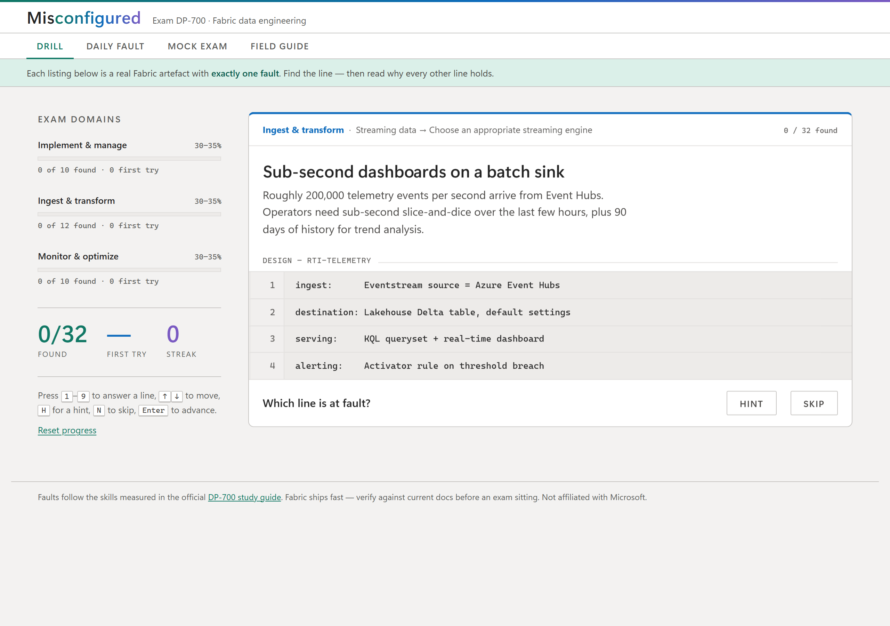
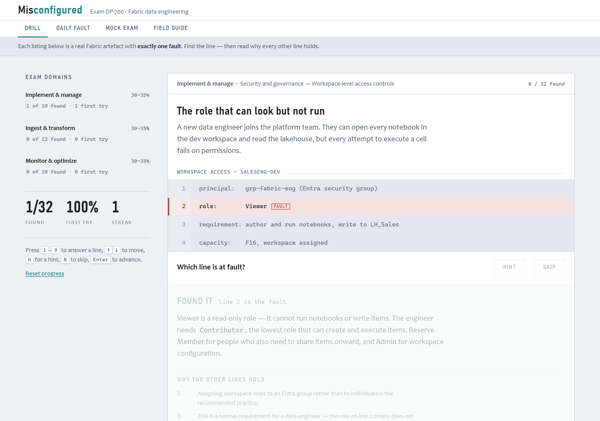
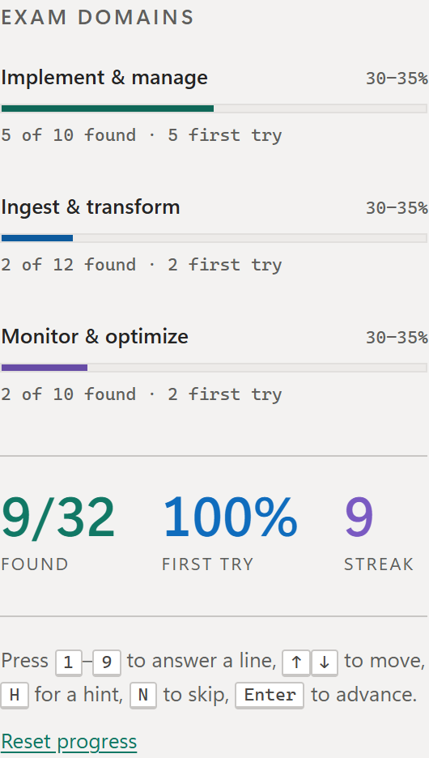

# Misconfigured — a DP-700 fault-finding drill

**DP-700 hands you a config and asks what is wrong with it. So does this — 32 times, and it tells you why every other line is fine. Then it puts you under exam conditions, tells you whether you'd pass, and lets you dare a friend to beat your score on the identical paper.**

### ▶ [Open the drill](https://oii-nasif.github.io/misconfigured-dp700/) · [Today's fault](https://oii-nasif.github.io/misconfigured-dp700/#daily) · [Sit the mock exam](https://oii-nasif.github.io/misconfigured-dp700/#exam) · [Field guide](https://oii-nasif.github.io/misconfigured-dp700/#guide)

No install, no account, no capacity. One HTML file that opens in about 200 ms and works offline.





---

An interactive study tool for **exam DP-700: Implementing Data Engineering Solutions Using Microsoft Fabric**.

Most exam prep tools test recall. DP-700 tests judgement — you are handed a config, a query, or a pipeline and asked what is wrong with it. So this one does that: each drill shows a realistic Fabric configuration as a numbered listing, and you pick the line at fault.

Crucially, the listings are **real artefacts, not prose**. A structured streaming writer, a KQL pipeline, a `CREATE TABLE`, a Git integration panel, an Eventhouse policy set. You read code and spot the broken line — which is the skill the job actually wants, and a harder one than eliminating options in a word problem.

Built for the Microsoft Fabric Discord **Certification Prep Challenge** (builder track).

## What it does

Four modes over one fault bank:

- **Drill** — the mastery loop. Work through every fault; misses requeue until you have found them all.
- **Daily fault** (`#daily`) — one fault per UTC day, **the same one for everyone**, drawn deterministically from the bank. Wrong picks stay counted; find it, keep the streak, paste the card. (32 faults means the cycle wraps monthly — stated plainly rather than pretended away.)
- **Mock exam** (`#exam`) — 20 faults drawn at exam weighting (6/7/7), one pass, **no hints, no retries, no feedback until the end**. Scored out of 1000 like the real paper, 700 to pass, misses come back as a revision list with full explanations. This is the mode that answers the only question a candidate actually has: *would I pass today?*
- **Field guide** (`#guide`) — every fault's takeaway rule as a searchable, domain-filterable index. *"OPTIMIZE compacts. VACUUM deletes. Only one of them is irreversible."* Each rule links back to the drill that teaches it. The night-before mode.

Two mechanics sharpen the mock exam:

- **Challenge papers.** Every exam is drawn from a short seed, and the result card carries `…#exam=<seed>~<score>` — anyone who opens that link sits the **identical 20-question paper** against your score, gets a head-to-head verdict, and can fire back a comeback card. No accounts, no backend: the paper and the score travel in the URL.
- **Sure / Not sure.** Before each verdict you commit a confidence call. The result then splits your misses into *gaps* (unsure and wrong) and *misconceptions* (sure and wrong) — the dangerous kind, reviewed first. Overconfidence on 20 items predicts a real-exam fail better than the raw score does. The idea is descended from Fabric Triage's confidence tagging (a fellow contest entry — credit where due), reduced to two levels so there is no dodge bucket.

And everything produces a **paste-ready result card**:

```
Misconfigured — DP-700 fault drill
🟩🟩🟨🟩🟩🟩🟩🟨🟩🟩 Implement & manage — 8/10 first try
🟩🟩🟩🟩🟩🟩🟩🟩🟩🟩🟩🟩 Ingest & transform — 12/12 first try
🟩🟨🟨🟩🟩🟩🟨🟩🟩🟩 Monitor & optimize — 7/10 first try
32/32 found · 27 first try · best streak 11
Mock exam best: 850/1000
https://oii-nasif.github.io/misconfigured-dp700/
```

```
Misconfigured — DP-700 mock exam · paper a3kf9x
🟩🟩🟨🟥🟩🟨🟩🟩🟧🟩🟩🟩🟨🟩🟥🟩🟩🟨🟩🟩
Score 850/1000 — PASS ✅ · 12m 40s · 2 confident misses
Beat me on the same paper: https://oii-nasif.github.io/misconfigured-dp700/#exam=a3kf9x~850
```

The card carries its own link — every paste is a playable dare.

The details:

- **32 faults** across all three exam domains — 10 / 12 / 10, matching the exam's even 30–35% weighting.
- Every listing is a plausible artefact: a Git integration panel, a Copy activity source query, a structured streaming writer, a KQL pipeline, a `CREATE TABLE`, Spark workspace settings, an Eventhouse policy set.
- After you answer: what the fault actually breaks, **why each of the other lines is fine** (the part most quiz apps skip), and a one-line takeaway rule.
- **Mastery loop, not a one-shot quiz.** A fault you miss goes back into the deck and returns later in the same run. You reach the summary only once you have correctly identified every fault in scope.
- **First-try accuracy** tracked separately from eventual success — the number that actually predicts an exam result. Domain meters show both.
- Optional hint per fault, before you commit.
- Domain meters double as filters in the drill and field guide; every view is deep-linkable (`#ingest`, `#monitor`, `#implement`, `#daily`, `#exam`, `#guide`, and `#exam=<seed>~<score>` for a challenge).
- Progress, streak and best streak persist in `localStorage`. No account, no backend, no telemetry.
- Keyboard driven: `1`–`9` to answer a line, `↑`/`↓` to move between lines, `H` for a hint, `N` to skip, `Enter` to advance — and in the exam, `1`/`2` for Sure / Not sure. The rail hint updates per mode.
- Screen-reader support: scenario, verdict and run summary are announced through a live region; every control is focusable with a visible focus state.

## Faults covered

**Implement and manage an analytics solution** (10) — one branch per workspace in Git integration · deployment rules belong to the target stage · OneLake `ReadAll` bypassing T-SQL row-level security · `GRANT UNMASK` defeating dynamic data masking · Dataflow Gen2 vs notebook vs pipeline · Viewer role cannot run notebooks · Certified is not self-service · Monitoring hub vs the unified audit log · schedule vs event-based trigger · the untagged parameter cell

**Ingest and transform data** (12) — inclusive watermark bounds duplicating rows · shortcuts under `Tables/` must be Delta · mirrored databases are read-only · one checkpoint location per streaming query · hopping window with hop > size · Eventhouse vs lakehouse at high velocity · Type 2 surrogate keys identify a version · lakehouse SQL endpoint is read-only · watermark shorter than real lateness · KQL filtering after `summarize` · `dropDuplicates` without a watermark · `IDENTITY` unsupported in Fabric Warehouse

**Monitor and optimize an analytics solution** (10) — `VACUUM RETAIN 0 HOURS` destroying time travel · partitioning on a second-precision timestamp · `On completion` masking upstream failure · high concurrency for many short notebooks · 2000 shuffle partitions for 2 GB · `collect()` on 80M rows · scheduling import refresh on a Direct Lake model · Eventhouse hot cache shorter than the query range · V-Order disabled on a read-heavy table · run durations vs the Capacity Metrics app

## Design notes

- Styled as a diagnostic console rather than a quiz: DIN-condensed signage type (Bahnschrift / Avenir Next Condensed) for headings, Candara for reading, Cascadia Mono for listings. No webfont requests — everything resolves from local stacks, so nothing can silently fall back.
- Blue-biased slate grounds with a single instrument-teal accent; pass/fault semantics keep their own colours so state reads at a glance without borrowing the accent.
- Full light and dark theming through CSS custom properties, honouring both `prefers-color-scheme` and an explicit `data-theme` override.
- `prefers-reduced-motion` respected throughout.

## Robustness

The parts that would fail quietly are checked rather than assumed:

- **Bank validation at boot.** Every entry is checked for a unique id, a known domain, 2–9 lines, an in-range fault line, and — the important one — exactly one explanation per non-fault line. Explanations are explicitly numbered rather than positionally inferred, so reordering a listing can no longer attach the right note to the wrong line. A malformed entry is skipped, reported in a notice bar, and detailed in the console; it can never render a misleading card.
- **Storage degrades instead of breaking.** Availability is probed with a real write; a private window or blocked cookies gets a notice and an in-memory session rather than an exception. Corrupt saved data is discarded with a warning. v1 progress is migrated forward.
- **No dead ends.** The same fault is never served twice in a row — unless it is the only one left, where an immediate repeat beats a false "done". Reset is two-step to prevent an accidental wipe. Skipping requeues rather than discarding.
- A headless behavioural suite is **committed and runnable** — `node test/behaviour.test.mjs`, no dependencies. It extracts the real inline script from `index.html`, runs it against a stub DOM, and makes 71 checks: the same seed always draws the identical paper and a different seed doesn't, the draw is exactly 6/7/7 with no duplicates, challenge specs parse and malformed ones degrade to a fresh paper, a perfect run scores 1000 and an all-wrong run 0 with all 20 misses reviewed confident-first, exam runs never touch drill mastery, an exam abandoned mid-question **resumes** where it left off with the unconfirmed pick dropped — including via browser Back, where the hash names the live paper — an expired challenge link says so instead of pretending, a daily click after UTC midnight redraws today's card rather than scoring against a fault you never saw, the daily fault is deterministic with correct streak arithmetic and closed days stay closed, and the share cards render the exact expected glyph counts.

## Running it

One file, no build step, no dependencies, no network calls.

```
open index.html
```

Or serve the folder however you like — GitHub Pages, Fabric Apps, anything static. Nothing in the page reaches the network, so it runs from a USB stick, an aeroplane, or a locked-down corporate laptop.

## Why a single static file

This was a deliberate choice rather than a shortcut, and it is worth stating plainly because the challenge invited us to try Fabric Apps and Rayfin.

A revision tool gets used at 11pm the night before the exam, on a phone, on hotel wifi. That is the moment it has to work. Anything that depends on a capacity being awake, an SSO round-trip completing, or a preview runtime behaving is a tool that can be unavailable exactly when it is needed — and a paused capacity costs nothing to the person who paused it and everything to the person revising.

So the constraint I set was: **no build, no dependencies, no network calls, no account.** Everything resolves from local font stacks, so nothing can silently fall back to a different typeface. Progress lives in `localStorage` and degrades to an in-memory session when storage is blocked. The whole app is one file you can read top to bottom, fork, and retarget at DP-600 by editing one array.

The trade-off is real and I am not going to pretend otherwise: there is no shared leaderboard, no cross-device sync, and no telemetry telling me which faults people miss most — all of which a Fabric-backed version would give you, and the semantic-model-over-your-own-telemetry idea is genuinely the more interesting engineering story. I traded those for a link that cannot break.

## Accuracy

Domains and objectives are taken from the [official DP-700 study guide](https://learn.microsoft.com/en-us/credentials/certifications/resources/study-guides/dp-700) (skills measured as of 21 July 2026). Explanations describe documented Fabric behaviour, but Fabric ships fast — verify against current docs before trusting anything here for an exam sitting. Not affiliated with Microsoft.

## Adapting it

All content lives in one `BANK` array near the top of the script. An entry looks like this:

```js
{
  id: "hopping-window",          // stable slug, also the progress key — never rename one
  domain: "ingest",              // implement | ingest | monitor
  objective: "Streaming data → Create windowing functions",
  title: "A window with holes in it",
  scenario: "Requirement: publish a rolling five-minute average …",
  listing: "Eventstream aggregation",
  lines: ["window:  Hopping", "size:  5 minutes", "hop:  10 minutes", …],
  fault: 3,                      // 1-based line number
  hint:  "Compare the hop against the window size …",
  why:   "Hop is how often a new window opens …",
  holds: [{ line: 1, text: "…" }, { line: 2, text: "…" }],  // one per NON-fault line
  ref:   "hop < size overlaps, hop = size tumbles, hop > size loses events."
}
```

Add faults, rewrite them, or retarget the whole thing at DP-600 by swapping `DOMAINS` and the bank. `validate()` runs at boot and will tell you exactly what is malformed rather than rendering a misleading card — including if your `holds` no longer cover every non-fault line. Append `#cm(...)` to a line to render a dimmed trailing comment.

## Roadmap

Two features earned a place here but not a rushed build:

- **Find it, then fix it** — a remediation beat after every fault: "what should you do?" with three plausible fixes. That is the real exam's dominant question stem, and the bank's `why` texts already name every fix. It needs ~96 hand-verified answer options, which deserve more care than a contest deadline allows.
- **Readiness predictor** — first-try rates weighted by domain into a predicted exam score with an honest confidence band. *Monitor and optimize an analytics solution — applied to yourself.*

## Licence

[MIT](LICENSE) — fork it, retarget it at another exam, keep the parts you like.
