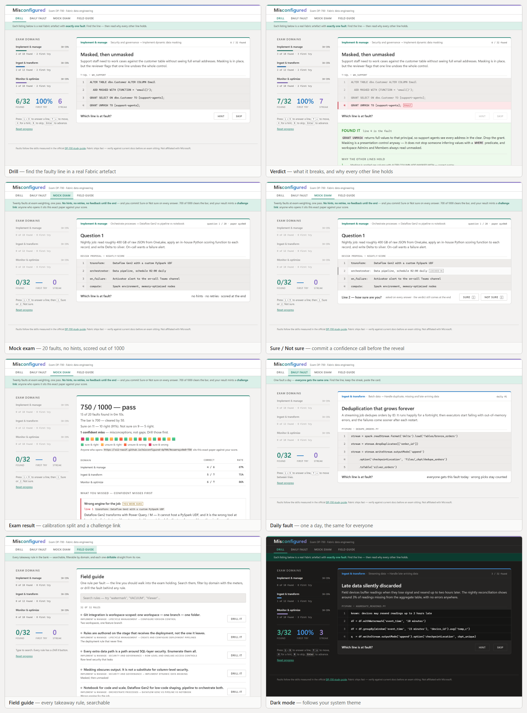

# Misconfigured — a DP-700 fault-finding drill

**DP-700 hands you a config and asks what is wrong with it. So does this — 32 times, and it tells you why every other line is fine. Then it puts you under exam conditions, tells you whether you'd pass, and lets you dare a friend to beat your score on the identical paper.**

### ▶ [Open the drill](https://oii-nasif.github.io/misconfigured-dp700/) · [Today's fault](https://oii-nasif.github.io/misconfigured-dp700/#daily) · [Sit the mock exam](https://oii-nasif.github.io/misconfigured-dp700/#exam) · [Field guide](https://oii-nasif.github.io/misconfigured-dp700/#guide)

No install, no account, no capacity. One HTML file that opens in about 200 ms and works offline. Built for the Microsoft Fabric Discord **Certification Prep Challenge** (builder track).


https://github.com/user-attachments/assets/962fb20e-3c3a-4380-8279-6404c95fb2d7




## What it does

Each drill shows a realistic Fabric artefact — a streaming writer, a KQL pipeline, a `CREATE TABLE`, a Git integration panel — as a numbered listing with **exactly one fault**. You pick the line, then read what it breaks and why every other line holds. Four modes over one bank of 32 faults (10 / 12 / 10 across the three exam domains, matching the exam's weighting):

- **Drill** — the mastery loop. Misses requeue until you have found every fault in scope.
- **Daily fault** (`#daily`) — one fault per UTC day, the same one for everyone, streak tracked.
- **Mock exam** (`#exam`) — 20 faults at exam weighting, no hints, no retries, scored out of 1000 with 700 to pass. Misses come back as a revision list.
- **Field guide** (`#guide`) — every fault's takeaway rule as a searchable index. The night-before mode.

Two mechanics sharpen the exam:

- **Challenge papers.** The result card carries `#exam=<seed>~<score>` — anyone opening that link sits the identical 20-question paper against your score. No accounts, no backend: the paper travels in the URL.
- **Sure / Not sure.** A confidence call before each verdict splits your misses into *gaps* (unsure) and *misconceptions* (sure but wrong) — the dangerous kind, reviewed first.

Everything produces a paste-ready result card:

```
Misconfigured — DP-700 mock exam · paper a3kf9x
🟩🟩🟨🟥🟩🟨🟩🟩🟧🟩🟩🟩🟨🟩🟥🟩🟩🟨🟩🟩
Score 850/1000 — PASS ✅ · 12m 40s · 2 confident misses
Beat me on the same paper: https://oii-nasif.github.io/misconfigured-dp700/#exam=a3kf9x~850
```

Also: first-try accuracy tracked separately from eventual success, domain meters that double as filters, deep links for every view, optional hint per fault, full keyboard driving (`1`–`9` answer, `H` hint, `N` skip, `Enter` advance), and screen-reader announcements throughout. Progress persists in `localStorage` — no telemetry, no network calls.

## Design

Themed after Microsoft Fabric: Fabric green with the workload gradient, one hue per exam domain (green / blue / purple) carried through the meters and cards, Segoe UI for text and Cascadia for listings — all from local font stacks, no webfont requests. Light and dark via `prefers-color-scheme` with a `data-theme` override; `prefers-reduced-motion` respected.

## Robustness

- **Bank validation at boot** — ids, domains, fault ranges, and one explanation per non-fault line are checked; a malformed entry is skipped and reported, never rendered misleadingly.
- **Storage degrades instead of breaking** — blocked or corrupt `localStorage` gets a notice and an in-memory session, not an exception.
- **A committed behavioural suite** — `node --test test/behaviour.test.mjs`, no dependencies. 71 checks over the real inline script: seeded papers reproduce exactly, exam scoring and resume, daily determinism and streaks, share-card glyph counts.

## Running and adapting it

Open `index.html`, or serve the folder from anything static. All content lives in one `BANK` array — add faults or retarget the whole thing at DP-600 by swapping `DOMAINS` and the bank; `validate()` tells you at boot exactly what is malformed.

## Accuracy

Domains and objectives follow the [official DP-700 study guide](https://learn.microsoft.com/en-us/credentials/certifications/resources/study-guides/dp-700) (skills measured as of 21 July 2026). Fabric ships fast — verify against current docs before an exam sitting. Not affiliated with Microsoft.

## Licence

[MIT](LICENSE) — fork it, retarget it at another exam, keep the parts you like.
